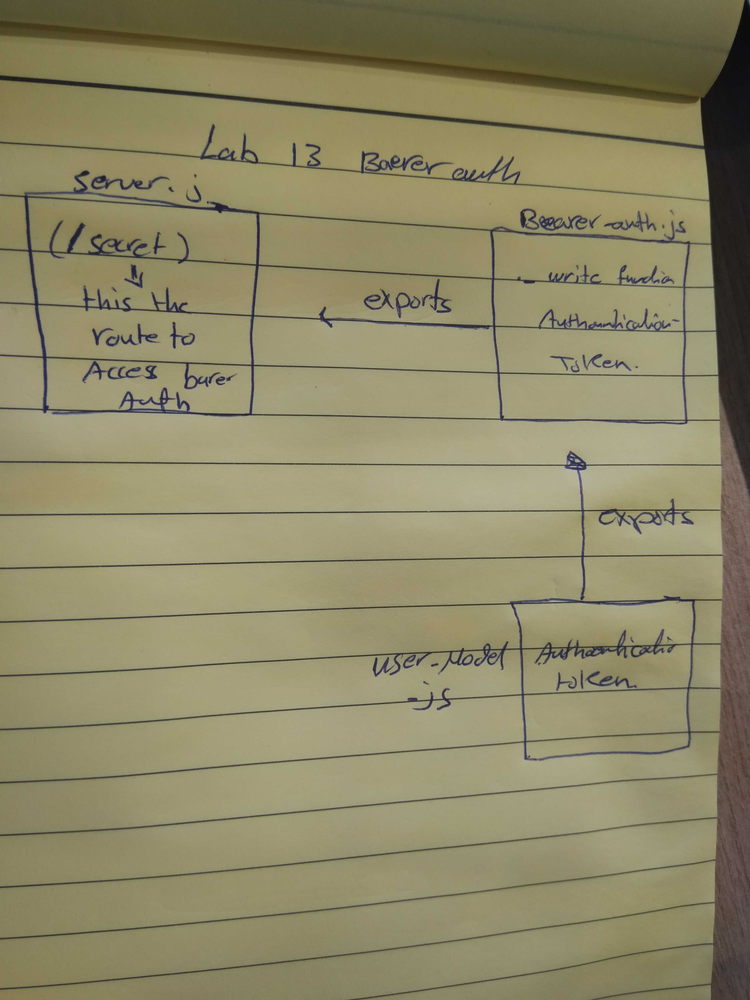

# lab13 
bearer-auth
## Author:
mai yousef and Muna
## Links and Resources
submission PR 

 ci/cd
 https://github.com/401-advanced-javascript-Mai/lab12/actions .

 ## How to initialize/run your application (where applicable)
npm run start

## Tests How do you run tests?
no test 

## .env 
PORT=3000
MONGOOSE_URI=mongodb://localhost:27017/authdb
SECRET=COOLMAI
CLINENT_ID=1aee4b1ac779e29bdc8c
CLINENT_SECRET=478787e62360c652af33a2cdd26420b8619325f7
API_SERVER=http://localhost:3000/oauth

## any tests of note? no Describe any tests that you did not complete, skipped, etc?
test not completed yet

## uml
